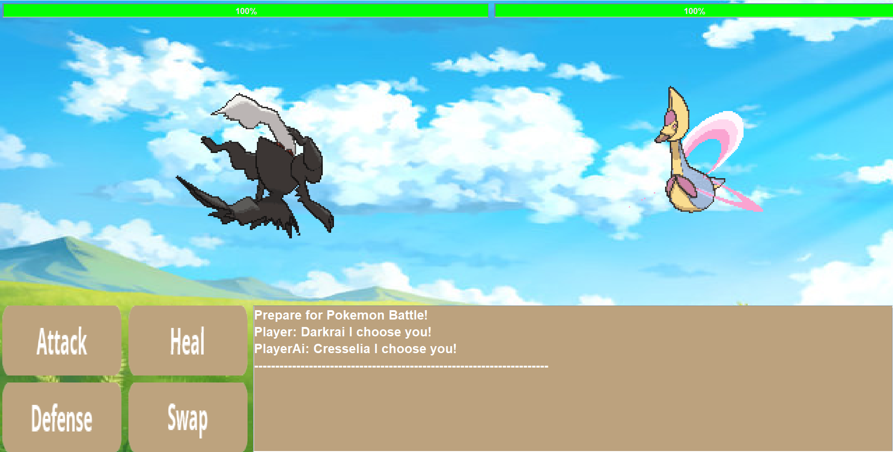

# Pokémon Battle Simulator 
This Pokémon Battle Simulator allows players to engage in exciting turn-based battles using various Pokémon. The simulator is designed to provide a realistic and engaging Pokémon battle experience, complete with different moves, strategies, and outcomes.

## Gameplay Features
- Turn-based combat system that mimics the official Pokémon games
- A selection of Pokémon each with unique stats and moves
- Randomized AI opponent behavior for varied gameplay
- Graphical interface showcasing the battle progress
- Background music and sound effects for an immersive experience 


## Installation

To set up and run this Java project on your local machine, follow these steps:

1. **Clone the Repository**
    ```sh
    git clone https://github.com/YehyunLee/PokemonGame
    cd PokemonGame
    ```

2. **Check for Java Installation**
    Ensure you have Java installed on your system. You can check this by running:
    ```sh
    java -version
    ```
    If Java is not installed, download and install it from [Oracle's Java website](https://www.oracle.com/java/technologies/javase-jdk11-downloads.html).

3. **Run the Project**
 Run the **main.java** inside **src/main**

6. **Enjoy the Game**
    The game should now start. Follow the on-screen instructions to play.

Note: These steps assume you have Git and Java correctly installed and configured on your system.
